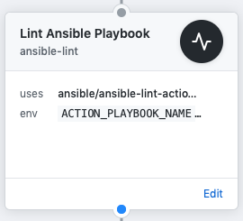
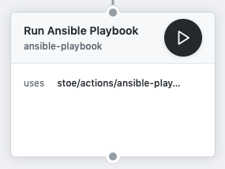

# GitHub Actions
This is a collection of [GitHub Actions](https://github.com/features/actions) ideas that might be useful.

## Ansible Lint

**_Ansible Lint for GitHub Action_ has been adopted by the [Ansible-lint project](https://github.com/ansible/ansible-lint).**
:octopus::cat::sparkling_heart:

The repository to find this action is: https://github.com/ansible/ansible-lint-action

You can also find it on the GitHub Marketplace: https://github.com/marketplace/actions/ansible-lint

## [Ansible Playbook](./ansible-playbook/)

## License
[MIT](license).
Please see additional information in each subdirectory.
